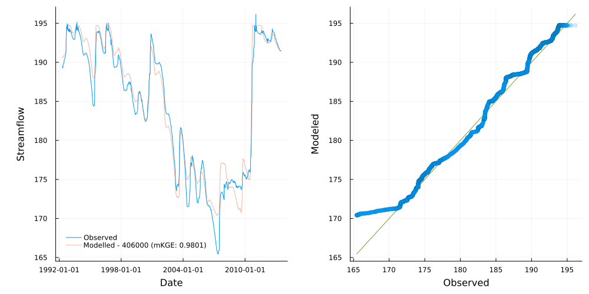
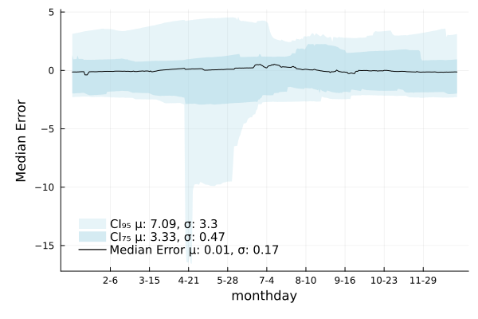

# Example calibration


```julia
"""
Example showcasing calibrating and running a streamflow network.

Data is prepped with the script `campaspe_data_prep.jl` in the `test/data/campaspe`
directory.
"""

using OrderedCollections
using Glob

using Statistics
using CSV, DataFrames, YAML
using Streamfall

using Plots


sn = load_network("Example Network", "../test/data/campaspe/campaspe_network.yml")

# The Campaspe catchment is represented as a network of eight nodes, including one dam.
# All nodes use the IHACRES_CMD rainfall-runoff model.
plot_network(sn)

# Load climate data - in this case from a CSV file with data for all nodes.
# Indicate which columns are precipitation and evaporation data based on partial identifiers
climate = Climate("../test/data/campaspe/climate/climate.csv", "_rain", "_evap")

# Historic flows and dam level data
calib_data = CSV.read(
    "../test/data/campaspe/gauges/outflow_and_level.csv",
    DataFrame;
    comment="#"
)

# Historic extractions from the dam
extraction_data = CSV.read("gauges/dam_extraction.csv", DataFrame; comment="#")

# We now have a dataset for calibration (`calib_data`) and a dataset indicating the
# historic dam extractions (`extraction_data`).
# `extraction_data` may also hold water extractions at each "reach".

# Provide a metric to use to fit models against data.
# Note that calibration always assumes minimization, so if the metric does not
# provide this directionality, it must be wrapped to do so.
metric = (y, y_hat) -> 1.0 - Streamfall.NNSE(y, y_hat)
# metric = (y, y_hat) -> 1.0 - Streamfall.NmKGE(y, y_hat)
# metric = (y, y_hat) -> 1.0 - Streamfall.naive_split_metric(
#     y, y_hat; n_members=7, metric=Streamfall.NmKGE, comb_method=mean
# )
# metric = Streamfall.RMSE

# Alternatively, individual metrics for each node in a dictionary
# (key-value pairs in the form of name => function).
# Here, Normalized KGE′ is used for all nodes.
# metrics = Dict{String,Function}(
#     n.name => (y, y_hat) -> 1.0 - Streamfall.NmKGE(y, y_hat) for n in sn
# )

# Calibrate all gauges in network using Adaptive Differential Evolution with the
# BlackBoxOptim.jl package. Any BlackBoxOptim keyword arguments are passed through.
# The parameter values provided in the network specification will be used as the initial
# guess.
# The default is to spend 5 mins on each node (MaxTime=300), but for this example we run
# calibration for 1mins/node (MaxTime=60).
# If the downstream node represents a dam, the current node is calibrated by fitting the
# outflows such that it reproduces the observed dam levels.
# The `weighting` parameter controls the weighting between nodes for calibration.
# A choice can be made to calibrate against outflows (a weighting of 1) or dam levels
# (a weighting of 0).
# Here, we calibrate to downstream dam levels only (a zero weighting on node outflows)
calibrate!(
    sn, climate, calib_data, metric;
    extraction=extraction_data, weighting=0.0,
    MaxTime=60.0
);

# Could calibrate a specific node, assuming all nodes upstream have already been calibrated
# Set `calibrate_all=true` to calibrate all upstream nodes as well.
# To produce the results shown below, the node upstream from the dam was calibrated an
# additional 2 hours.
# calibrate!(
#     sn, 2, climate, calib_data, metric;
#     extraction=extraction_data, weighting=0.0, calibrate_all=false,
#     MaxTime=7200.0
# );

# Run all nodes in the catchment
run_catchment!(sn, climate; extraction=extraction_data)

# Get performance metrics for dam levels
dam_obs = calib_data[:, "406000"]
dam_node = sn[3]
dam_sim = dam_node.level

Streamfall.RMSE(dam_obs[366:end], dam_sim[366:end])
Streamfall.NSE(dam_obs[366:end], dam_sim[366:end])
Streamfall.mKGE(dam_obs[366:end], dam_sim[366:end])

# Plot results
f = quickplot(dam_obs, dam_sim, climate, "Modelled - 406000", false; burn_in=366)
savefig(f, "example_dam_level.png")

# Save calibrated network to a file
save_network(sn, "example_network_calibrated.yml")

# Illustrating that the re-loaded network reproduces the results as above
sn2 = load_network("Calibrated Example", "example_network_calibrated.yml")
run_catchment!(sn2, climate; extraction=extraction_data)

dam_node = sn2[3]
dam_sim = dam_node.level

rmse_score = Streamfall.RMSE(dam_obs[366:end], dam_sim[366:end])
nse_score = Streamfall.NSE(dam_obs[366:end], dam_sim[366:end])
mKGE_score = Streamfall.mKGE(dam_obs[366:end], dam_sim[366:end])

@info "Scores: " rmse_score nse_score mKGE_score

f2 = quickplot(dam_obs, dam_sim, climate, "Modelled - 406000", false; burn_in=366)

temporal_cross_section(sim_dates, calib_data[:, "406000"], sn2[3].level)
```

The last two lines produces the plots below



The `quickplot()` function creates the figure displayed above which shows dam levels on the
left (observed and modelled) with a [Q-Q plot](https://en.wikipedia.org/wiki/Q%E2%80%93Q_plot)
on the right.



The above shows a "cross-section" of model predictions for each month-day across simulation
time. It is useful to gain an understanding on when models may underperform and give a
sense of a models predictive uncertainty. The units of the y-axis are the same as for the
node (in this case, meters).

Ideally, the median error would be a straight line and the confidence intervals would
be as thin and consistent as possible for all month-days.

Here, we see that while performance is generally good (mean of Median Error is near zero),
the model can under-estimate dam levels in late-April to May and displays a tendency to
over-estimate dam levels between January and June, relative to other times.
