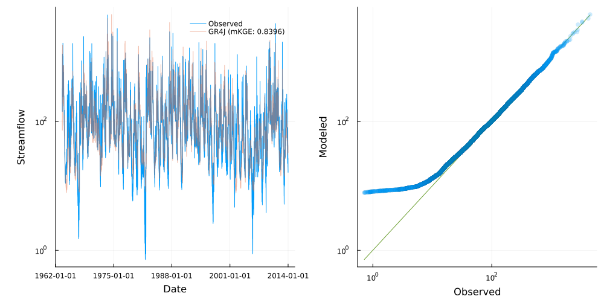
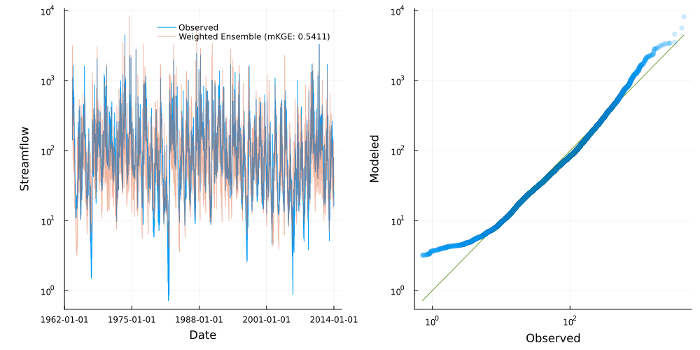
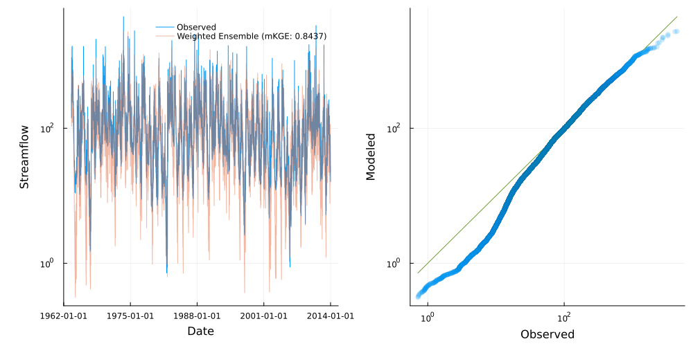

# Customized calibration

Streamfall provides built-in methods for model calibration, but custom metrics 
and objective functions can be defined to better suit specific calibration needs. This
example demonstrates how to create custom metrics that combine multiple performance metrics 
or apply specific weightings to different aspects of model performance.

## Basic Structure

Streamfall adopts a two-pronged approach to handling objective functions.

The first is a "default" method assigned to each node (which can be overwritten/replaced).

A custom objective function for calibration typically accepts:
1. The parameter values to be evaluated
2. Climate data for the simulation
3. The network or node being calibrated
4. Observational data for comparison
5. The metric used to assess performance
6. Inputs to account for additional inflow, extraction and groundwater flux

The function then returns a single scalar value representing the optimization target 
(to be minimized).

Below is an example of the default implementation, copied and defined outside of Streamfall.

```julia
function custom_obj_func(
    params, climate::Streamfall.Climate, node::Streamfall.NetworkNode, calib_data::Array;
    metric::F, inflow=nothing, extraction=nothing, exchange=nothing
) where {F}
    update_params!(node, params...)

    metric_func = (sim, obs) -> handle_missing(metric, sim, obs; handle_missing=:skip)

    run_node!(node, climate; inflow=inflow, extraction=extraction, exchange=exchange)
    score = metric_func(node.outflow, calib_data)

    # Reset to clear stored values
    reset!(node)

    return score
end

# Example usage: create a node
ihacres_node = create_node(IHACRESBilinearNode, "410730_ihacres", 129.2)

# Replace default method with the custom objective function
ihacres_node.obj_func = custom_obj_func

# Then proceed with calibration as normal
# calibrate!(...);
```

The above allows a finer level of control, allowing the objective function to account for
climatic conditions as well as other external forcings (such as groundwater exchange).

Alternatively, performance metrics can be defined for specific nodes, or node instances
that make up an ensemble.

Lets begin with a default calibration for comparison

```julia
using Statistics
using CSV, DataFrames
using Streamfall
using StatsPlots  # To activate visualization extensions

# Set up data
data_dir = joinpath(
    dirname(dirname(pathof(Streamfall))),
    "test/data"
)

# Historic flows
obs_data = CSV.read(
    joinpath(data_dir, "cotter/climate/CAMELS-AUS_410730.csv"),
    DataFrame;
    comment="#"
)

Qo = extract_flow(obs_data, "410730")
climate = extract_climate(obs_data)

# Create a node
gr4j_node = create_node(GR4JNode, "410730", 129.2)

# Calibrate the model using NmKGE
calibrate!(
    gr4j_node, climate, Qo, (obs, sim) -> 1.0 - Streamfall.NmKGE(obs, sim);
    extraction=extraction_data, weighting=0.0,
    MaxTime=300.0
);

# Visualize model performance (using a 1-year burn-in period)
burn_in = 366
burn_obs = Qo[burn_in:end, "410730"]
run_node!(gr4j_node, climate)
gr4j_qp = quickplot(burn_obs, gr4j_node.outflow[burn_in:end], climate; label="GR4J", log=true)
# savefig(gr4j_qp, "default_calibration_gr4j.png")
```

Below, the calibration is repeated using a custom metric which targets low-flow conditions.

```julia
# Create a node
gr4j_node = create_node(GR4JNode, "410730", 129.2)

# Define a custom objective function that combines multiple metrics to better account for
# low-flow periods
function custom_low_flow_objective(obs, sim)
    # Filter for low flow periods (e.g., flow < 10th percentile)
    low_flow_threshold = quantile(obs, 0.1)
    low_flow_indices = findall(obs .<= low_flow_threshold)
    
    # Calculate metrics for low-flow periods
    if !isempty(low_flow_indices)
        # Apply log transform to emphasize low flow performance
        log_obs = log.(obs[low_flow_indices] .+ 1e-6)
        log_sim = log.(sim[low_flow_indices] .+ 1e-6)

        # Note: we are using Normalized versions of the usual metrics
        #       so the returned values are 0 - 1.
        #       We then take the complement as the optimizer seeks to 
        #       minimize error.
        kge_low = 1.0 - Streamfall.NmKGE(log_obs, log_sim)
        
        # Calculate metrics for all flows for balance
        kge_all = 1.0 - Streamfall.NmKGE(obs, sim)
        
        # Combined score - weighting more heavily toward low flows
        score = (0.7 * kge_low) + (0.3 * kge_all)
    else
        # Fallback if no low flows found
        score = 1.0 - Streamfall.NmKGE(obs, sim)
    end
    
    return score
end

# Calibrate the model
calibrate!(
    gr4j_node, climate, Qo, custom_low_flow_objective;
    extraction=extraction_data, weighting=0.0,
    MaxTime=300.0
);

# Visualize model performance (using a 1-year burn-in period)
burn_in = 366
burn_obs = Qo[burn_in:end, "410730"]
run_node!(gr4j_node, climate)
gr4j_qp = quickplot(burn_obs, gr4j_node.outflow[burn_in:end], climate; label="Weighted Ensemble", log=true)
# savefig(gr4j_qp, "custom_calibration_gr4j.png")
```




The results show improved performance under low-flow conditions, at the expense of
mid-to-high flow conditions.

Below is an example of defining a performance metric for specific nodes.
For further detail on ensemble modeling, see the section on [Weighted Ensemble Modeling](@ref).

```julia
# Reload data (just in case modifications were made)
obs_data = CSV.read(
    joinpath(data_dir, "cotter/climate/CAMELS-AUS_410730.csv"),
    DataFrame;
    comment="#"
)

Qo = extract_flow(obs_data, "410730")
climate = extract_climate(obs_data)

# Create one instance each of IHACRES_CMD, GR4J and SIMHYD
ihacres_node = create_node(IHACRESBilinearNode, "410730_ihacres", 129.2)
gr4j_node = create_node(GR4JNode, "410730_gr4j", 129.2)
simhyd_node = create_node(SIMHYDNode, "410730_simhyd", 129.2)

# Create a weighted ensemble with equal weights
# The default behavior is to combine component predictions with a normalized weighted sum.
ensemble = create_node(
    WeightedEnsembleNode, 
    [ihacres_node, gr4j_node, simhyd_node], 
    [0.5, 0.5, 0.5]
)

# Define a custom objective function that combines multiple metrics
function custom_low_flow_objective(obs, sim)
    # Filter for low flow periods (e.g., flow < 10th percentile)
    low_flow_threshold = quantile(obs, 0.1)
    low_flow_indices = findall(obs .<= low_flow_threshold)

    # Calculate metrics for all flows for balance
    kge_all = 1.0 - Streamfall.NmKGE(obs, sim)
    
    # Calculate metrics for low-flow periods
    if !isempty(low_flow_indices)
        # Apply log transform to emphasize low flow performance
        log_obs = log.(obs[low_flow_indices] .+ 1e-6)
        log_sim = log.(sim[low_flow_indices] .+ 1e-6)

        # Note: we are using Normalized versions of the usual metrics
        #       so the returned values are 0 - 1.
        #       We then take the complement as the optimizer seeks to 
        #       minimize error.
        kge_low = 1.0 - Streamfall.NmKGE(log_obs, log_sim)
        
        # Combined score - weighting more heavily toward low flows
        score = (0.8 * kge_low) + (0.2 * kge_all)
    else
        # Fallback if no low flows found
        score = kge_all
    end
    
    return score
end

# Assign different metrics to individual nodes
# Make the GR4J node use the custom low-flow metric
custom_metrics = Dict(
    "410730_ihacres" => (obs, sim) -> 1.0 - Streamfall.NmKGE(obs, sim),
    "410730_gr4j" => custom_low_flow_objective,
    "410730_simhyd" => (obs, sim) -> 1.0 - Streamfall.NmKGE(obs, sim)
)

# Copy flow data (these can be nodes in a network)
Qo[:, "410730_ihacres"] = Qo[:, "410730"]
Qo[:, "410730_gr4j"] = Qo[:, "410730"]
Qo[:, "410730_simhyd"] = Qo[:, "410730"]

# Copy climate data for each node (these can be nodes in a network)
insertcols!(
    climate.climate_data, 
    "410730_ihacres_P" => climate.climate_data[:, "410730_P"], 
    "410730_ihacres_PET" => climate.climate_data[:, "410730_PET"], 
    "410730_ihacres_Q" => climate.climate_data[:, "410730_Q"],
    "410730_gr4j_P" => climate.climate_data[:, "410730_P"], 
    "410730_gr4j_PET" => climate.climate_data[:, "410730_PET"], 
    "410730_gr4j_Q" => climate.climate_data[:, "410730_Q"],
    "410730_simhyd_P" => climate.climate_data[:, "410730_P"], 
    "410730_simhyd_PET" => climate.climate_data[:, "410730_PET"], 
    "410730_simhyd_Q" => climate.climate_data[:, "410730_Q"]
)

# Use the custom objective function in calibration
calibrate_instances!(
    ensemble,
    climate, 
    Qo,
    custom_metrics;
    MaxTime=300
)

burn_in = 366
burn_obs = Qo[burn_in:end, "410730"]
run_node!(ensemble, climate)
ensemble_qp = quickplot(burn_obs, ensemble.outflow[burn_in:end], climate; label="Weighted Ensemble", log=true)
# savefig(ensemble_qp, "custom_calibration_ensemble.png")
```



Here we see the weighted ensemble retains much of the performance characteristics under
a variety of conditions.

## Tips for Custom Objective Functions

1. **Normalization**: Ensure different metrics are on comparable scales. Consider normalizing values to [0,1] range.

2. **Complementary Metrics**: Different metrics capture different aspects of performance. Combining KGE (overall performance) with RMSE (high flows) and log-transformed metrics (low flows) provides balanced calibration.

3. **Weighting**: Adjust weights based on your modeling priorities. Higher weights lead to more emphasis on specific aspects.

4. **Error Handling**: Include error checking for edge cases (e.g., all zero flows, missing data).

5. **Time Efficiency**: Keep objective functions computationally efficient as they'll be called many times during calibration.

## Further Reading

For theoretical background on objective functions and performance metrics:

1. Fowler, K., Peel, M., Western, A., Zhang, L., 2018. \
   Improved Rainfall-Runoff Calibration for Drying Climate: Choice of Objective Function. \
   Water Resources Research 54, 3392–3408. \
   https://doi.org/10.1029/2017WR022466

2. Garcia, F., Folton, N., Oudin, L., 2017. \
   Which objective function to calibrate rainfall–runoff models for low-flow index simulations? \
   Hydrological Sciences Journal 62, 1149–1166. \
   https://doi.org/10.1080/02626667.2017.1308511