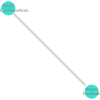
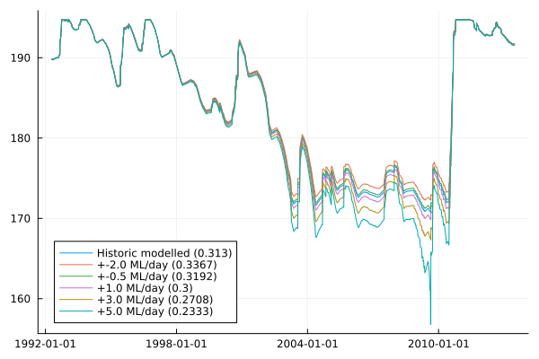

# Simple two-system interaction

Here, a two-node network including a river and a dam is represented. The example is
based on the Lower Campaspe catchment - a small semi-arid basin in North-Central Victoria,
Australia.



The dam is the primary water store for farmers in the area. In this simplified example, we
investigate the effect of changing water demands and related policies on historic dam levels.
Water demands may shift due to choice in cultivated crops, changing water management
practices, investment into more efficient irrigation systems, choice in crops, or a
systemic change to water policies.

In essence, this is a cursory investigation into "what might have been" if the regional
context were different.

For the purpose of this example, the farm water requirements are defined as a volume of
daily water requirements throughout a growing season. A growing season is the period of time
over which a crop is cultivated, and is assumed to be between *May* and *February*.
In practice, water requirements are provided by another model.

```julia
using CSV, DataFrames, YAML
using Dates
using Plots
using Streamfall

# Load climate data - in this case from a CSV file with data for all nodes.
# Indicate which columns are precipitation and evaporation data based on partial identifiers
climate = Climate("../test/data/campaspe/climate/climate.csv", "_rain", "_evap")

# Historic extractions from the dam
extraction_data = CSV.read("../test/data/campaspe/gauges/dam_extraction.csv", DataFrame; comment="#")

# Load the example network
sn = load_network("Example Network", "../test/data/campaspe/two_node_network.yml")

# Run the model for the basin to obtain baseline values
run_basin!(sn, climate; extraction=extraction_data)
baseline_dam_level = sn[2].level
baseline_dam_outflow = sn[2].outflow

# Get represented dates for simulation
sim_dates = Streamfall.timesteps(climate)

# Create DataFrame to use as a template to store water extractions
extractions = copy(extraction_data)

"""
Convenience function handling interactions with all "external" models.
Note: We are using a burn-in period of a year.
"""
function run_scenario(sn, climate, extractions, increased_demand; burn_in=366)
    reset!(sn)
    inlets, outlets = find_inlets_and_outlets(sn)

    extractions = copy(extractions)

    sim_dates = Streamfall.timesteps(climate)
    prep_state!(sn, length(sim_dates))

    for (ts, date) in enumerate(sim_dates)
        if ((month(date) >= 5) || (month(date) <= 2))
            # Within growing season (May - Feb)

            # Additional agricultural water demand (ML/day) from historic conditions
            # This would normally come from another model indicating daily water demands.
            extractions[ts, "406000_releases_[ML]"] += increased_demand
        end

        for outlet in outlets
            run_node!(sn, outlet, climate, ts; extraction=extractions)
        end
    end

    # Return dam levels for assessment
    return sn[2].level[burn_in:end]
end

"""
A hypothetical Critical Threshold index.

Mean of proportional distance to critical threshold (default 55% of dam capacity).
Values of 1 indicate the dam is always full, negative values indicate the dam levels are
below the critical threshold.

Greater values indicate greater water security but may have trade-offs with regard to
environmental outcomes and farm profitability.
"""
function critical_threshold_index(levels; threshold=0.55)
    max_level = 195
    min_level = 160  # mAHD

    # Essentially proportion of dam capacity
    relative_level = ((levels .- min_level) ./ (max_level - min_level))

    # Distance
    indicator = (relative_level .- threshold) ./ (1.0 - threshold)

    return round(mean(indicator), digits=4)
end


ct_index = critical_threshold_index(baseline_dam_level[366:end])
f = plot(sim_dates[366:end], baseline_dam_level[366:end]; label="Historic modelled ($(ct_index))")
results = Vector{Vector{Float64}}(undef, 5)

for (i, daily_demand) in enumerate([-2.0, -0.5, 1.0, 3.0, 5.0])
    results[i] = run_scenario(sn, climate, extractions, daily_demand)

    ct_index = critical_threshold_index(results[i])

    plot!(sim_dates[366:end], results[i]; label = "+$(daily_demand) ML/day ($(ct_index))")
end
display(f)
# savefig("simple_water_demand.png")

Streamfall.temporal_cross_section(sim_dates, calib_data[:, "406000"], sn[2].level)
```


