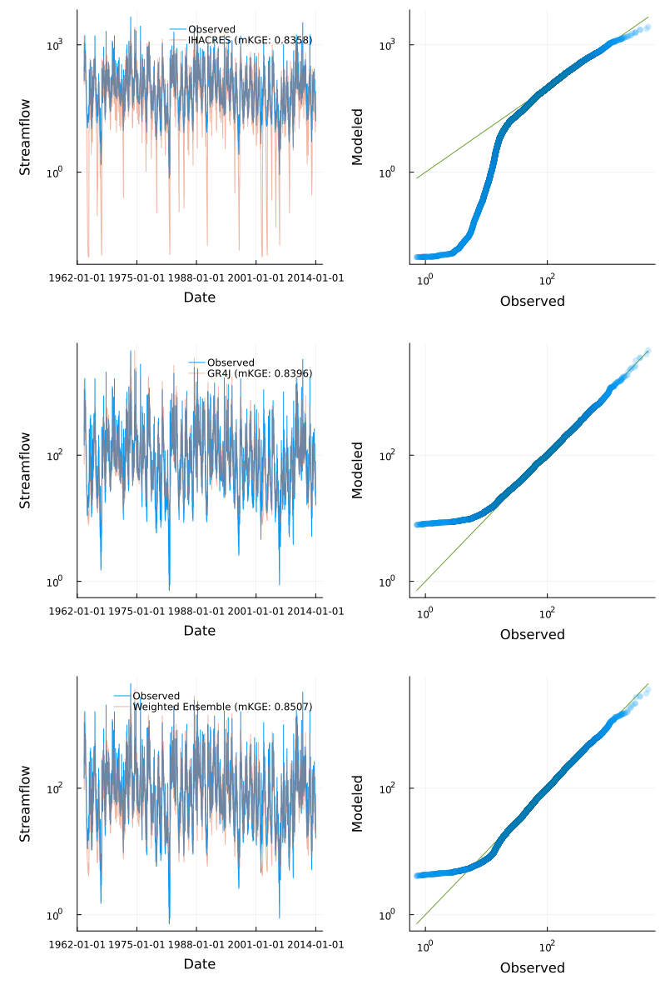
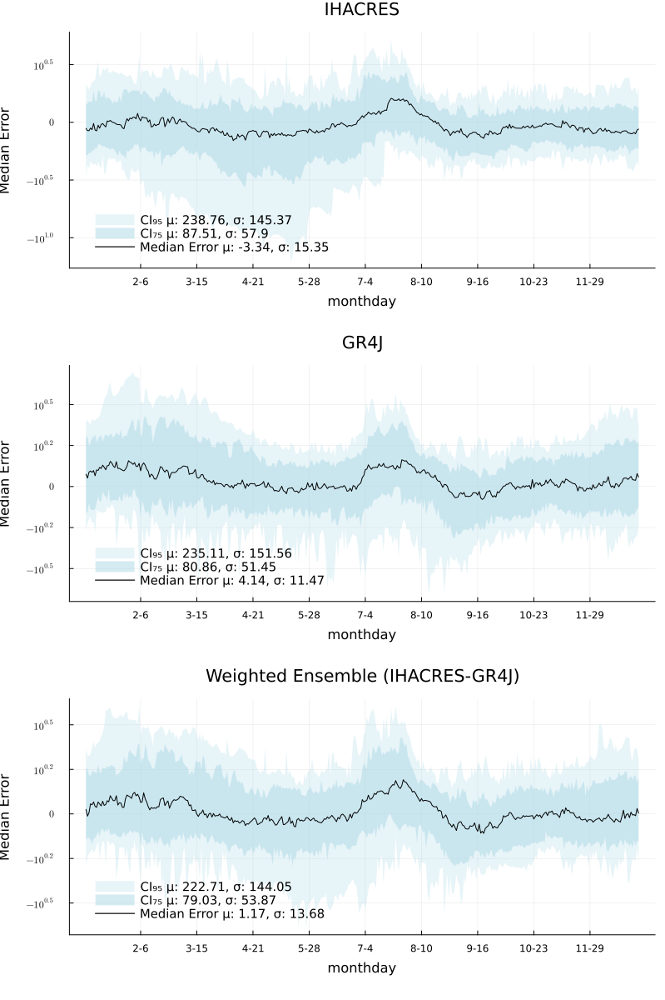
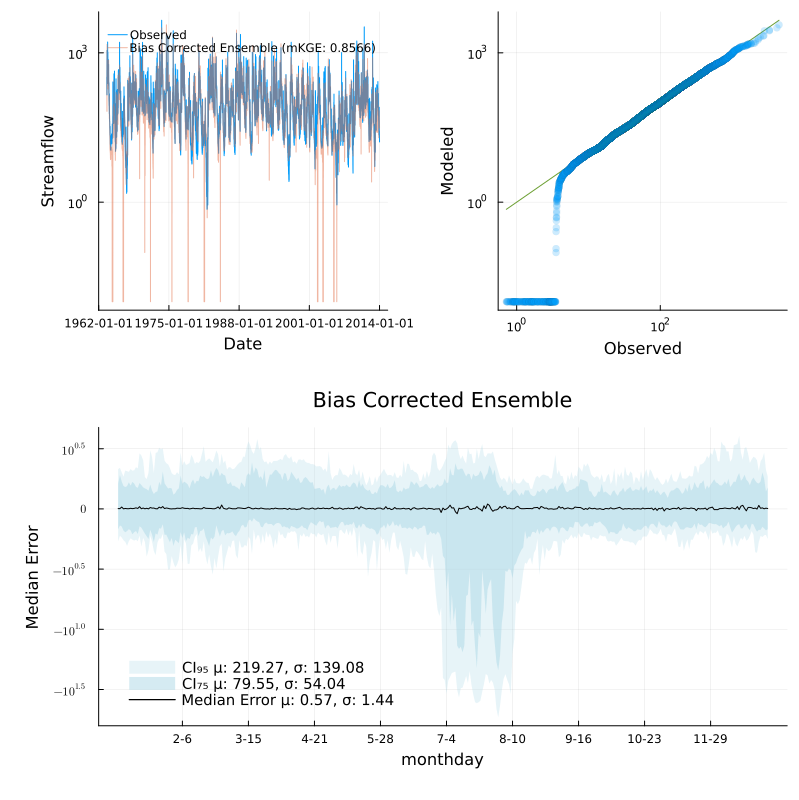

Streamfall supports ensemble modeling using individual instances of rainfall-runoff models
as the ensemble constituents. The default ensemble is a normalized weighted sum.

The usual setup process is shown here, detailed in previous sections of this guide.

```julia
using YAML, DataFrames, CSV, Plots
using Statistics
using Streamfall


climate = Climate("../test/data/campaspe/climate/climate.csv", "_rain", "_evap")

# Historic flows and dam level data
obs_data = CSV.read(
    "../test/data/cotter/climate/CAMELS-AUS_410730.csv",
    DataFrame;
    comment="#"
)

Qo = extract_flow(obs_data, "410730")
climate = extract_climate(obs_data)
```

Specific node representations can then be created, each representing the same sub-catchment.
A stream network is not considered for this demonstration.

```julia

# Create one instance each of IHACRES_CMD and GR4J
ihacres_node = create_node(IHACRESBilinearNode, "410730", 129.2)
gr4j_node = create_node(GR4JNode, "410730", 129.2)

# Create a weighted ensemble with equal weights
# The default behavior is to combine component predictions with a normalized weighted sum.
ensemble = create_node(WeightedEnsembleNode, [ihacres_node, gr4j_node], [0.5, 0.5])
```

In previous examples, the `calibrate!()` method was used to calibrate nodes to available
data. For WeightedEnsembleNodes, `calibrate!()` optimizes just the weights to allow for
pre-calibrated instances to be provided for use in an ensemble. This may be useful if
it is desired for the component models to be calibrated according to different criteria and
objective functions.

A separate `calibrate_instances!()` method is available to calibrate individual component
models (and the weights used).

```julia
# The default behaviour for WeightedEnsembleNodes are to calibrate just the weights.
# res, opt = calibrate!(ensemble, climate, Qo, (obs, sim) -> 1.0 .- Streamfall.NmKGE(obs, sim); MaxTime=180)

# Here, the component models are uncalibrated so we calibrate these and the weights.
res, opt = calibrate_instances!(ensemble, climate, Qo, (obs, sim) -> 1.0 .- Streamfall.NmKGE(obs, sim); MaxTime=180)
```

Running the calibrated models directly, the amount of improvement to model performance can
be assessed. Here, a 1-year burn in period is used.


```julia
run_node!(ihacres_node, climate)
run_node!(gr4j_node, climate)
run_node!(ensemble, climate)

burn_in = 365
burn_dates = timesteps(climate)[burn_in:end]
burn_obs = Qo[burn_in:end, "410730"]

ihacres_qp = quickplot(burn_obs, ihacres_node.outflow[burn_in:end], climate, "IHACRES", true)
gr4j_qp = quickplot(burn_obs, gr4j_node.outflow[burn_in:end], climate, "GR4J", true)
ensemble_qp = quickplot(burn_obs, ensemble.outflow[burn_in:end], climate, "Weighted Ensemble", true)

plot(ihacres_qp, gr4j_qp, ensemble_qp; layout=(3, 1), size=(800, 1200))
```

Below a small improvement to model performance based on the modified Kling-Gupta Efficiency
score can be seen. Comparing the Q-Q plots, IHACRES had a tendency to underestimate low
flows and high flows, whereas GR4J had a tendency to overestimate low flows.

The weighted ensemble combined characteristics of both, with a tendency to overestimate
low flows as with GR4J.



Comparing the temporal cross section:

```julia
ihacres_xs = temporal_cross_section(burn_dates, burn_obs, ihacres_node.outflow[burn_in:end]; title="IHACRES")
gr4j_xs = temporal_cross_section(burn_dates, burn_obs, gr4j_node.outflow[burn_in:end]; title="GR4J")
ensemble_xs = temporal_cross_section(burn_dates, burn_obs, ensemble.outflow[burn_in:end]; title="Weighted Ensemble (IHACRES-GR4J)")

plot(ihacres_xs, gr4j_xs, ensemble_xs; layout=(3, 1), size=(800, 1200))
```

A reduction in the median error can be seen with extreme errors reduced somewhat (according to
the 95% CI).



The median error can then be applied to modelled streamflow (on a month-day basis) as a
form of bias correction.

```julia
q_star = Streamfall.apply_temporal_correction(ensemble, climate, Qo[:, "410730"])

bc_ensemble_qp = quickplot(burn_obs, q_star[burn_in:end], climate, "Bias Corrected Ensemble")

bias_corrected_xs = temporal_cross_section(
    burn_dates,
    burn_obs,
    q_star[burn_in:end];
    title="Bias Corrected Ensemble"
)

plot(bc_ensemble_qp, bias_corrected_xs; layout=(2,1), size=(800, 800))
```

While the median error has increased, its variance has reduced significantly. At the same
time, performance at the 75 and 95% CI remain steady relative to the original weighted
ensemble results.


