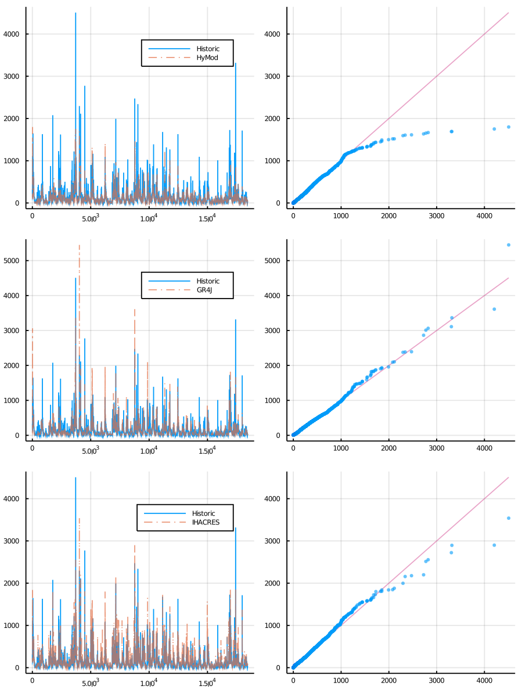

# Model comparison example

This example showcases a comparison of models using multi-processing.

```julia
using Distributed, Plots, StatsPlots


HERE = @__DIR__

if nworkers() < 3
    addprocs(3, exeflags="--project=$(Base.active_project())")
end

@everywhere begin
    using DataFrames, CSV
    using Streamfall, BlackBoxOptim

    HERE = @__DIR__
    DATA_PATH = joinpath(HERE, "../test/data/cotter/")

    # Load observations
    date_format = "YYYY-mm-dd"
    obs_data = DataFrame!(CSV.File(joinpath(DATA_PATH, "climate/CAMELS-AUS_410730.csv"),
                            comment="#",
                            dateformat=date_format))

    hist_streamflow = obs_data[:, ["Date", "410730_Q"]]
    climate_data = obs_data[:, ["Date", "410730_P", "410730_PET"]]
    climate = Climate(climate_data, "_P", "_PET")

    burn_in = 366  # 1 year burn-in period

    # Create objective function to minimize (here we use Normalized KGE')
    func = (obs, sim) -> 1.0 - Streamfall.NmKGE(obs[burn_in:end], sim[burn_in:end])
    opt_func = (node) -> calibrate!(node, climate, hist_streamflow, Streamfall.data_extraction, func; MaxTime=120)
end


# Create individual nodes
hymod_node = create_node(SimpleHyModNode, "410730", 129.2)
gr4j_node = create_node(GR4JNode, "410730", 129.2)
ihacres_node = create_node(BilinearNode, "410730", 129.2)

# Calibrate each node separately using multiprocessing
node_names = ["HyMod", "GR4J", "IHACRES"]
node_list = [hymod_node, gr4j_node, ihacres_node]
result = pmap(opt_func, node_list)

# Create comparison plot
# Note: there is a convenience `quickplot` method, but in this case
#       we want fine-grain control over how the plot is created.
Qo = hist_streamflow[:, "410730_Q"]
Qo_burn = Qo[burn_in:end]
res_plots = []
for ((res, opt), node, n_name) in zip(result, node_list, node_names)
    update_params!(node, best_candidate(res)...)    
    reset!(node)
    run_node!(node, climate)

    node_burn = node.outflow[burn_in:end]
    tmp_plot = plot(Qo_burn, label="Historic")
    plot!(node_burn, label=n_name, alpha=0.7, linestyle=:dashdot)

    qq_plot = qqplot(Qo_burn, node_burn, markerstrokewidth=0, alpha=0.6)
    res_plot = plot(
        tmp_plot,
        qq_plot,
        layout=(1,2)
    )

    push!(res_plots, res_plot)
end

combined_plot = plot(
    plot(res_plots[1]),
    plot(res_plots[2]),
    plot(res_plots[3]),
    layout=(3,1),
    size=(900,1200),
)

display(combined_plot)

# savefig("multi_model_comparison.png")
```

