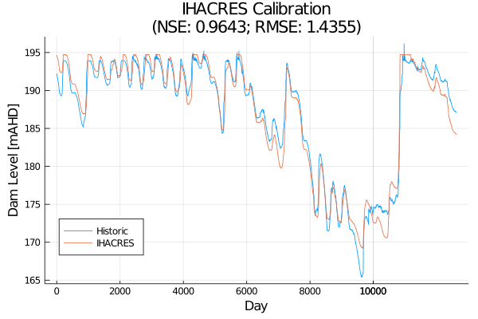
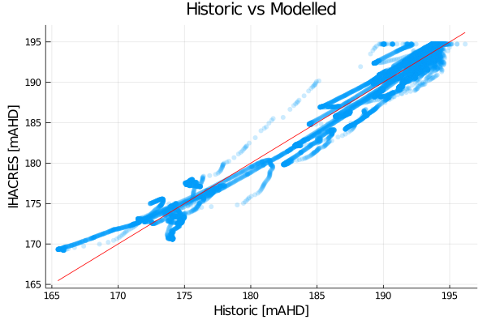

# A simple showcase of a hydrological system

Here we showcase a two-node network representing a river and a dam downstream.

The Lower Campaspe catchment - a small semi-arid basin in North-Central Victoria, Australia - is used for the example here.

- Figure of catchment

As a graph, the network looks like this:

- Figure of two-node network

Which represents the following area:

- Zoomed in figure of the previous figure showing dam and area above the dam

In this example, we are focused on representing dam levels.


This example uses the setup as detailed in [Calibration setup](@ref)


```julia
@info "Running example stream..."

reset!(sn)

run_node!(node::NetworkNode, climate; inflow=nothing, water_order=nothing, exchange=nothing)

timesteps = sim_length(climate)

dam_id, dam_node = get_gauge(sn, "406000")
run_node!(sn, dam_id, climate; water_order=hist_dam_releases)

h_data = hist_dam_levels[:, "Dam Level [mAHD]"]
n_data = dam_node.level

nnse_score = Streamfall.NNSE(h_data, n_data)
nse_score = Streamfall.NSE(h_data, n_data)
rmse_score = Streamfall.RMSE(h_data, n_data)

@info "NNSE:" nnse_score
@info "NSE:" nse_score
@info "RMSE:" rmse_score

nse = round(nse_score, digits=4)
rmse = round(rmse_score, digits=4)

# Calibration results
plot(h_data,
     legend=:bottomleft,
     title="Calibrated IHACRES\n(NSE: $(nse); RMSE: $(rmse))",
     label="Historic", xlabel="Day", ylabel="Dam Level [mAHD]")

plot!(n_data, label="IHACRES")

savefig("calibration_ts_comparison.png")

# 1:1 Plot
scatter(h_data, n_data, legend=false, 
        markerstrokewidth=0, markerstrokealpha=0, alpha=0.2)
plot!(h_data, h_data, color=:red, markersize=.1, markerstrokewidth=0,
      xlabel="Historic [mAHD]", ylabel="IHACRES [mAHD]", title="Historic vs Modelled")

savefig("calibration_1to1.png")
```




